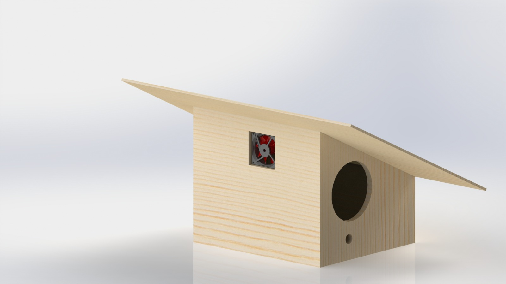

# [Birdie]

Welcome to [Birdie] – A Smart Birdhouse Project

## Overview

[Birdie] is an innovative initiative that brings together technology and nature. This project involves the creation of a Smart Birdhouse equipped with sensors to monitor the environment, capture images, videos, and audio recordings of birds in their natural habitat. The collected data is seamlessly transmitted to an AI-powered web platform, providing a comprehensive analysis of bird activity.

## How It Works

1. **Smart Birdhouse Technology:**
   - Utilizes an Arduino microcontroller, temperature and humidity sensors, a camera, and a microphone.
   - Monitors the internal conditions of the birdhouse to ensure a comfortable environment for birds.
   - Captures high-resolution images, videos, and audio recordings of bird activity.

2. **AI-Powered Web Platform:**
   - Analyzes the collected data using advanced artificial intelligence algorithms.
   - Provides insights into bird behavior, patterns, and environmental conditions.
   - Enables users to explore and understand the birdhouse data in a visually appealing and informative manner.

3. **Subscription-Based Mobile App:**
   - Offers a dedicated mobile app for bird enthusiasts.
   - Runs on a subscription basis, providing exclusive access to the analyzed data.
   - Delivers a personalized and interactive experience, allowing users to connect with the birdhouse and its inhabitants.

## Features

- Real-time monitoring of temperature, humidity, and bird activity.
- High-quality image and video capture capabilities.
- AI-driven insights for a deeper understanding of bird behavior.
- Subscription-based mobile app for enthusiasts to access exclusive data.

## Getting Started

To set up the Smart Birdhouse and access the AI-powered web platform, follow the instructions in the [Documentation](docs/README.md).

## Subscription Plans

Explore our subscription plans on the [Mobile App](app/README.md) to gain exclusive access to the captivating world of birds.

## Contributing

We welcome contributions from the community! Check out the [Contribution Guidelines](CONTRIBUTING.md) to get started.

## License

This project is licensed under the [License Name] - see the [LICENSE](LICENSE) file for details.

---

**[Your Project Name] - Connecting Nature with Innovation**

For any inquiries, please contact [Your Contact Email].
